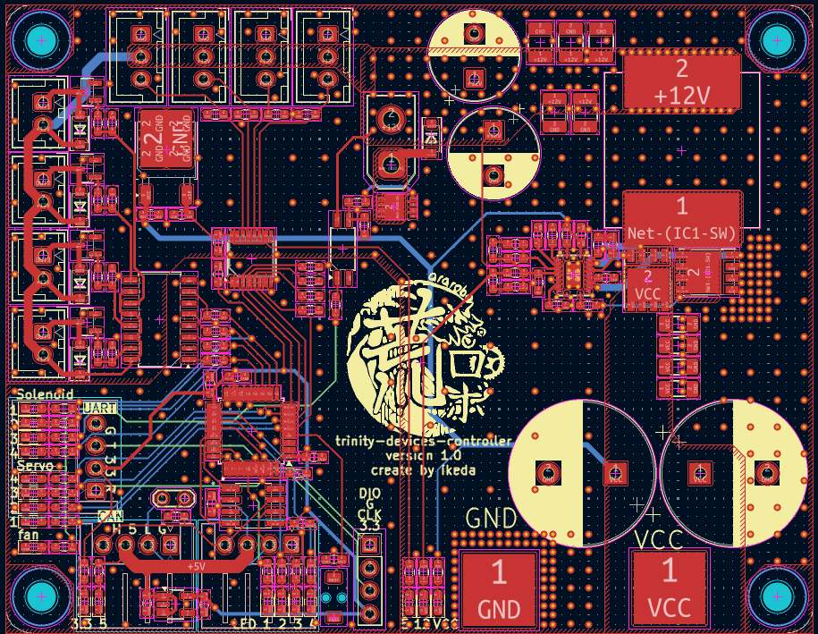

# Trinity Devices Controller

高出力12Vを生成し、各種デバイスを駆動するモジュール。

## 目次

1. [概要](#1-概要)
2. [ドキュメント](#2-ドキュメント)
3. [ビルド・使い方](#3-ビルド使い方)
4. [システム構成](#4-システム構成)
5. [ライセンス](#5-ライセンス)

## 1. 概要

電磁弁やDCファンなどを動作可能。
gn10-canプロトコルに準拠しCAN通信で操作可能。

## 2. ドキュメント

| ドキュメント | 説明 |
| :-: | :-: |
| [CONTRIBUTING.md](./CONTRIBUTING.md) | 開発フロー・コミット規約・コーディング規約 |
| [docs/coding-rules.md](./docs/coding-rules.md) | コーディング規約の詳細 |
| [docs/uml/](./docs/uml/) | UML図 |

## 3. ビルド・使い方

1. ファームウェアのビルド

2. STLinkによる書き込み

## 4. システム構成

## 5. ライセンス

本リポジトリは [MITライセンス](./LICENSE) のもとで公開されています。
